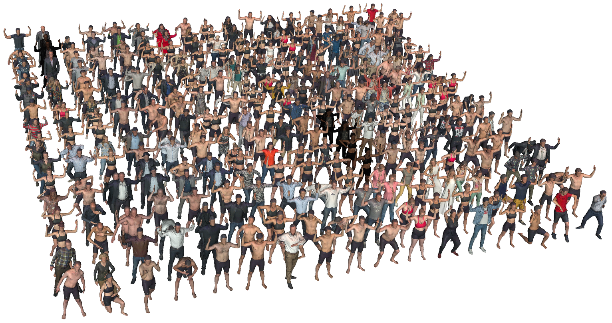

# 3DBodyTex 2

3DBodyTex 2 contains thousands of 3D textured human scans.
It is an extension of [3DBodyTex](https://cvi2.uni.lu/datasets/).

## Content

- 3D human scans (`Y`):
  - acquired with the [Shapify Booth][shapify booth],
  - many subjects,
  - varied poses,
  - varied casual clothing,
  - standard tight-fitting clothing,
  - 3D watertight meshes with a high-resolution texture atlas;
- 3D landmarks:
  - body joints and landmark points on the surface,
  - estimated automatically;
- Fitted textured SMPL-X model (`Yf`):
  - SMPL-X is fitted to all the raw scans `Y` to obtain `Yf`,
  - pose and shape parameters,
  - fixed template mesh (SMPL-X),
  - texture mapped from the raw scans;
- Simulated 3D scan acquisitions (`Ys`):
  - the process of the [Shapify Booth][shapify booth] is simulated in software,
  - the acquisition is simulated on the fitted SMPL-X models `Yf` to obtain
    `Ys`;
- Synthetic pairs `(Yf, Ys)` of `(detailed ground truth, acquisition)`:
  - `Yf` is a synthetic groud truth with detailed shape and texture,
  - `Ys` is a synthetic scan acquisition with typical artefacts.

[shapify booth]: https://www.artec3d.com/portable-3d-scanners/shapifybooth

## Usage in the SHARP [Challenge 1](challenge_1.md)

### [Track 1](challenge_1_track_1.md): Recovery of large regions

- The ground truth is `Y`.
- The partial scans are generated from `Y`.
- The 3D landmarks are provided at training time only, not at evaluation time.

### [Track 2](challenge_1_track_2.md): Recovery of fine details

- The ground truth is `Yf`.
- The partial scans are generated from `Ys`.
- The 3D landmarks are provided at training only, not at evaluation time.

## Detailed description and statistics

### Clothing

casual | fitness
-|-
![casual][img-casual] | ![fitness][img-fitness]

[img-casual]: data/3dbodytex2-casual-a-small.png "casual"
[img-fitness]: data/3dbodytex2-fitness-a-small.png "fitness"

### Poses

A | U | run | scape | free
-|-|-|-|-
![][img-pose-a] | ![][img-pose-u] | ![][img-pose-run] | ![][img-pose-scape-0] ![][img-pose-scape-1] ![][img-pose-scape-2] ... | unconstrained

[img-pose-a]: data/3dbodytex2-casual-a-small.png "pose-a"
[img-pose-u]: data/3dbodytex2-casual-u-small.png "pose-u"
[img-pose-run]: data/3dbodytex2-casual-run-small.png "pose-run"
[img-pose-scape-0]: data/3dbodytex2-casual-scape003-small.png "pose-scape-003"
[img-pose-scape-1]: data/3dbodytex2-casual-scape032-small.png "pose-scape-032"
[img-pose-scape-2]: data/3dbodytex2-casual-scape070-small.png "pose-scape-070"

### Number of scans for different types of clothing and pose

clothing\pose | all | A | U | run | scape | free
-|-|-|-|-|-|-
fitness | | | | | |
casual | | | | | |
all | | | | | |

## Encoding formats and conventions

### Formats

Meshes are in the `.npz` format.
Landmark positions are in a custom tabular text format.
See [formats](formats.md).

### Orientation

The up direction is the y axis.
The ground is the x-z plane.
Most scans are facing the -z direction, but not all.

### Units

Vertex positions are in metres.

## 3D body landmarks

67 body landmarks are detected automatically on each scan.
They are provided to generate the partial data but can also be used for
training.
They comprise standard body joints and other keypoints on the body (eyes, nose,
ears...).
The detection of most landmarks is stable except for the finger joints and
finger tips.

The landmark names are listed below with the following notation:

- `<side>` is `left` or `right`,
- `<knuckle>` is one of `base`, `middle`, `top`, `tip`.

### Body joints (20)

| landmark name    |
| -                |
| ankle_\<side>    |
| elbow_\<side>    |
| heel_\<side>     |
| hip_\<side>      |
| hip_middle       |
| knee_\<side>     |
| neck             |
| shoulder_\<side> |
| toe_1_\<side>    |
| toe_5_\<side>    |
| wrist_\<side>    |

### Face landmarks (5)

| landmark name |
| -             |
| ear_\<side>   |
| eye_\<side>   |
| nose          |

### Finger joints and tips (42)

| landmark name                    |
| -                                |
| finger_baby_\<knuckle>_\<side>   |
| finger_index_\<knuckle>_\<side>  |
| finger_middle_\<knuckle>_\<side> |
| finger_ring_\<knuckle>_\<side>   |
| finger_thumb_\<knuckle>_\<side>  |
| hand_base_\<side>                |
